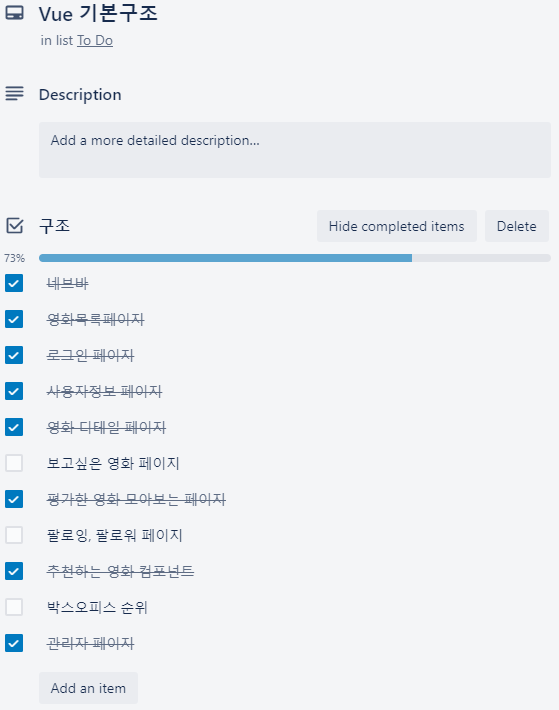
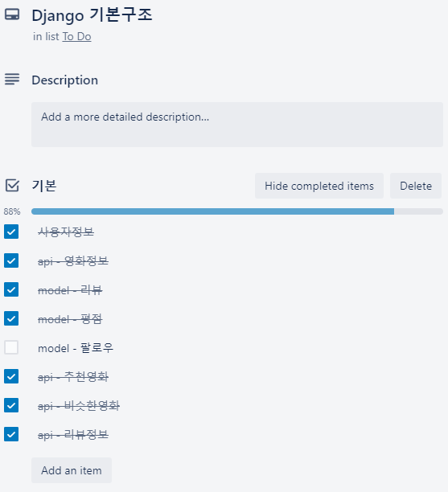
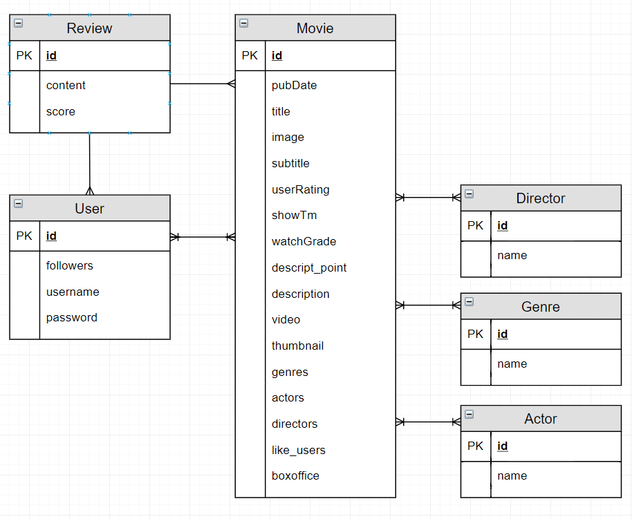
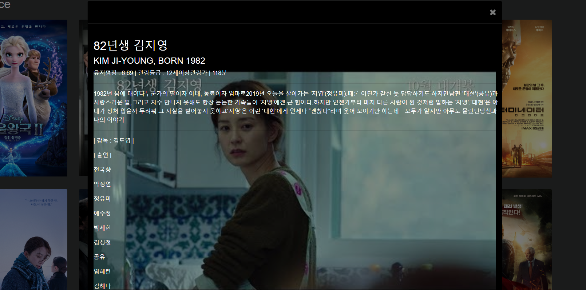

# CineSafari

#### 1. 팀원정보 및 업무 분담내역

김승연 - Backend - (Django, Python)

김기범 - Frontend - (Vue, Javascript)


#### 2. 목표 서비스 구현 및 실제 구현 정도






#### 3. 데이터베이스 모델링




#### 4. 핵심 기능

##### 데이터 정보 크롤링 및 모델 저장

```python
from django.shortcuts import render, get_object_or_404
import json, os, requests
from decouple import config
from datetime import datetime, timedelta
from ..serializers import GenreSerializer, DirectorSerializer, MovieSerializer, ActorSerializer, UserSerializer, CreateUserSerializer, ReviewSerializer
from rest_framework.decorators import api_view, permission_classes,authentication_classes
from rest_framework.permissions import IsAuthenticated, AllowAny
from rest_framework_jwt.authentication import JSONWebTokenAuthentication
from ..models import Movie, Genre, Director, Actor, Review
from django.contrib.auth import get_user_model
from django.http import JsonResponse, HttpResponse
from bs4 import BeautifulSoup
import urllib.request
from accounts.models import User

# 박스오피스 데이터 api에서 모아서 저장하기
@api_view(['GET'])
@permission_classes((AllowAny,))
def boxoffice_create(request):
    for i in range(3, 100):
        now = datetime.now() + timedelta(weeks=-i)
        today = now.strftime('%Y%m%d')
        MOVIE_KEY = config('MOVIE_KEY')
        BASIC_URL = 'http://www.kobis.or.kr/kobisopenapi/webservice/rest/boxoffice/searchWeeklyBoxOfficeList.json'
        DETAIL_URL = 'http://www.kobis.or.kr/kobisopenapi/webservice/rest/movie/searchMovieInfo.json'
        MOVIE_URL = f'{BASIC_URL}?key={MOVIE_KEY}&targetDt={today}'
        movie_datas = requests.get(MOVIE_URL).json()

        # 네이버
        NAVER_ID = config('NAVER_ID')
        NAVER_SECRET = config('NAVER_KEY')
        NAVER_URL = 'https://openapi.naver.com/v1/search/movie.json'

        headers = {
            'X-Naver-Client-Id': NAVER_ID,
            'X-Naver-Client-Secret': NAVER_SECRET,
        }

        # 유튜브 데이터
        GOOGLE_KEY = config('GOOGLE_KEY')
        GOOGLE_URL = f"https://www.googleapis.com/youtube/v3/search?key={GOOGLE_KEY}&part=snippet&type=video&q="
        ########################################################## 수정
        movie_detail_datas = []
        imageurls = []
        naver_scores = []
        rank = []
        watchgrades = []
        showtimes = []
        descriptions = []
        videos = []
        descript_points = []
        thumbnails = []
        directors = set()
        actors = set()
        genres = set()
        idx = 0
        for movie_data in movie_datas['boxOfficeResult']['weeklyBoxOfficeList']:
            movie_name = movie_data['movieNm']
            what = False
            try:
                Movie.objects.get(title=movie_name)
                what = True
                pass
            except:

                naver_data = requests.get(f'{NAVER_URL}?query={movie_name}', headers=headers).json()
                movie_code = movie_data['movieCd']
                movie_detail_data = requests.get(f'{DETAIL_URL}?key={MOVIE_KEY}&movieCd={movie_code}').json()
                movie_detail_datas.append(movie_detail_data)
                if i == 1:
                    rank.append(movie_data['rank'])
                else:
                    rank.append(0)
                if 'audits' in movie_detail_data['movieInfoResult']['movieInfo']:
                    if movie_detail_data['movieInfoResult']['movieInfo']['audits']:
                        watchgrades.append(movie_detail_data['movieInfoResult']['movieInfo']['audits'][0]['watchGradeNm'])
                    else:
                        watchgrades.append("")    
                else:
                    watchgrades.append("")
                if 'showTm' in movie_detail_data['movieInfoResult']['movieInfo']:
                    if movie_detail_data['movieInfoResult']['movieInfo']['showTm'] == "":
                        showtimes.append(0)
                    else:
                        showtimes.append(movie_detail_data['movieInfoResult']['movieInfo']['showTm'])
                else:
                    showtimes.append(0)
                if 'items' in naver_data:
                    if naver_data['items']:
                        if 'userRating' in naver_data['items'][0]:
                            naver_score = naver_data['items'][0]['userRating']
                        else:
                            naver_score = 0
                    else:
                        naver_score = 0
                    # 이미지 가져오기
                    stackcode = []
                    if naver_data['items']:
                        image_code = naver_data['items'][0]['link']
                    for j in range(len(image_code)-1, -1, -1):
                        if image_code[j] == '=':
                            break
                        else:
                            stackcode.insert(0, image_code[j])
                    image_code = ''.join(stackcode)
                    image_detail = 'https://movie.naver.com/movie/bi/mi/photoViewPopup.nhn?movieCode='
                    img_url = image_detail + image_code
                    html = urllib.request.urlopen(img_url)
                    source = html.read()
                    soup = BeautifulSoup(source, "html.parser")
                    img = soup.find("img")
                    if img:
                        img_src = img.get("src")
                        imageurls.append(img_src)
                    else:
                        imageurls.append("")

                    # 스토리 가져오기
                    descript_url = "https://movie.naver.com/movie/bi/mi/basic.nhn?code=" + image_code
                    html = urllib.request.urlopen(descript_url)
                    source = html.read()
                    soup = BeautifulSoup(source, "html.parser")
                    descript = soup.find("p", {"class": "con_tx"})
                    if descript:
                        temp = descript.text
                        temp = temp.replace('\r', '')
                        temp = temp.replace('\xa0', '')
                        descriptions.append(temp)
                    else:
                        descriptions.append("no descript")
                    # 한줄스토리 가져오기
                    descript_point = soup.find("h5", {"class":"h_tx_story"})
                    if descript_point:
                        temp = descript_point.text
                        temp = temp.replace('\r', '')
                        temp = temp.replace('\xa0', '')
                        descript_points.append(temp)
                    else:
                        descript_points.append("no descript_point")    
                else:
                    naver_score = 0
                    imageurls.append("nosrc")
                    descriptions.append("no descript")
                    descript_points.append("no descript_point")
                naver_scores.append(naver_score)

                if len(naver_data['items']) > 0:
                    image_data = naver_data['items'][0]['image']
                    movie_datas['boxOfficeResult']['weeklyBoxOfficeList'][idx]['image'] = image_data
                
                # 비디오 정보 가져오기 + 썸네일
                video_datas = requests.get(f"{GOOGLE_URL}{movie_name}예고편").json()
                if 'items' in video_datas:
                    videos.append(video_datas['items'][0]['id']['videoId'])
                    thumbnails.append(video_datas['items'][0]['snippet']['thumbnails']['high']['url'])
                else:
                    videos.append("")
                    thumbnails.append("")


                # 영화감독, 배우 추가            
                if movie_detail_data['movieInfoResult']['movieInfo']['directors']:
                    for one in movie_detail_data['movieInfoResult']['movieInfo']['directors']:
                        directors.add(one['peopleNm'])
                if movie_detail_data['movieInfoResult']['movieInfo']['actors']:
                    for one in movie_detail_data['movieInfoResult']['movieInfo']['actors']:
                        actors.add(one['peopleNm'])
                if movie_detail_data['movieInfoResult']['movieInfo']['genres']:
                    for one in movie_detail_data['movieInfoResult']['movieInfo']['genres']:
                        genres.add(one['genreNm'])
                idx += 1
            if what:
                pass
            else:
                for one in actors:
                    Actor.objects.get_or_create(name=one)
                for one in directors:
                    Director.objects.get_or_create(name=one)
                for one in genres:
                    Genre.objects.get_or_create(name=one)


                idx = 0
                for one in movie_detail_datas:
                    title = one['movieInfoResult']['movieInfo']['movieNm']
                    image = imageurls[idx]
                    subtitle = one['movieInfoResult']['movieInfo']['movieNmEn']
                    pubDate = one['movieInfoResult']['movieInfo']['openDt']
                    if pubDate == "":
                        pubDate=0
                    userRating = naver_scores[idx]
                    boxoffice = rank[idx]
                    watchGrade = watchgrades[idx]
                    description = descriptions[idx]
                    descript_point = descript_points[idx]
                    showTm = showtimes[idx]
                    video = videos[idx]
                    thumbnail = thumbnails[idx]
                    movie = Movie.objects.get_or_create(title=title, image=image, subtitle=subtitle, pubDate=pubDate, userRating=userRating, boxoffice=boxoffice, 
                    watchGrade=watchGrade, showTm=showTm, description=description, descript_point=descript_point, video=video, thumbnail=thumbnail)[0]
                    for genre in one['movieInfoResult']['movieInfo']['genres']:
                        genreinstance = Genre.objects.get(name=genre['genreNm'])
                        movie.genres.add(genreinstance)
                    for director in one['movieInfoResult']['movieInfo']['directors']:
                        directorinstance = Director.objects.get(name=director['peopleNm'])
                        movie.directors.add(directorinstance)
                    for actor in one['movieInfoResult']['movieInfo']['actors']:
                        actorinstance = Actor.objects.get(name=actor['peopleNm'])
                        movie.actors.add(actorinstance)
                    idx += 1
            

    moviedatas = list(Movie.objects.values())
    return JsonResponse(moviedatas, safe=False)
```


##### 사용자가 좋은 리뷰를 남긴 영화 추천

```python
from accounts.models import User
from ..models import Movie, Genre, Director, Review, Actor
from django.http import JsonResponse, HttpResponse
from rest_framework.decorators import api_view, permission_classes,authentication_classes
from rest_framework.permissions import IsAuthenticated, AllowAny
from rest_framework_jwt.authentication import JSONWebTokenAuthentication
from django.db.models import Q
import operator
from django.forms.models import model_to_dict
import json
from django.core import serializers
from ..serializers import MovieSerializer, GenreSerializer
@api_view(['GET'])
@permission_classes((AllowAny,))
def recommand(request, id):
    if id == 0:
        user = User.objects.get(id=1)
    else:
        user = User.objects.get(id=id)
    # 처음온 사람이 아니면
    # 리뷰를 쓴 갯수 확인
    reviews = user.review_set
    if reviews.count():
        # 유저가 쓴 리뷰들 모아오기
        reviews = Review.objects.filter(user_id=id)
        like_reviews = []
        for review in reviews:
            if review.score > 6:
                like_reviews.append(review)
        movie_ids = list(map(lambda x:x.movie_id, like_reviews))
        # 유저가 본 좋아하던 영화들 모아오기
        movies = Movie.objects.filter(id__in=movie_ids)
        # 본 영화 모으기
        every_ids = list(map(lambda x:x.movie_id, reviews))
        every_movies = Movie.objects.filter(id__in=every_ids)
        # 유저가 좋아하는 장르 뽑기
        genres = {} # id: 장르점수
        for movie in movies:
            for genre in movie.genres.all(): 
                if genre in genres:
                    genres[genre] += 1
                else:
                    genres[genre] = 1

        # 순서대로 나열해서 가중치대로 나열하기 내림차순
        sortedgenres = sorted(genres.items(), key=operator.itemgetter(1), reverse=True)
        #  가장 좋아하는 장르 3가지가 있는 영화 추천
        removies = []
        for i in range(3):
            if sortedgenres:
                one = sortedgenres.pop(0)
                movies = Movie.objects.filter(genres=one[0]).filter(~Q(id__in=every_movies))[:10]
                removies.extend(movies)
        serializers = MovieSerializer(removies, many=True)
        return JsonResponse(serializers.data, safe=False)
        
    # 좋은 리뷰가 많은 순으로 추천
    else:
        reviews = Review.objects.all()
        like_reviews = []
        for review in reviews:
            if review.score > 6:
                like_reviews.append(review)
        movie_ids = list(map(lambda x:x.movie_id, like_reviews))

        # 유저들이 본 좋아하던 영화들 모아오기
        movies = Movie.objects.filter(id__in=movie_ids)[:10]
        serializers = MovieSerializer(movies, many=True)
        return JsonResponse(serializers.data, safe=False)
```


##### 비슷한 영화 장르 추천

```python
@api_view(['GET'])
@permission_classes((AllowAny,))
def similar(request, id):
    movie = Movie.objects.get(id=id)
    # 영화의 장르들 모으기
    genres = []
    for genre in movie.genres.all():
        genres.append(genre)
    # 같은 장르의 영화들 모으기
    movies = Movie.objects.filter(genres__in=genres).filter(~Q(id=id))[:5]
    serializers = MovieSerializer(movies, many=True)
    return JsonResponse(serializers.data, safe=False)
```


##### Modal



##### Carousel


#### 5. 배포 서버 URL


#### 6. 느낀점

김승연

```notepad
기능 구현에 많은 시간을 할애하고 싶었지만 생각보다 데이터를 모아서 정제하는데 하나의 API가 모든 정보를 가지고 있지 않아서 크롤링과 구글API, 네이버API, 영화진흥위원회API 를 사용하면서 만들었습니다. Vue에서 요구하는 정보를 전달하는 과정에서 serializer의 역할을 정확하게 모르고 있었지만 이번 프로젝트를 함으로써 정확하게 이해할 수 있는 기회가 되었습니다. 추천알고리즘을 더 복잡하게 짜고 싶었지만 생각보다 영화 데이터의 양을 많이 모을 수 없어서 공통점이 장르만 남아서 다른 방식의 추천을 만들지 못해 아쉬움이 남는 프로젝트였습니다.
```


김기범 

```notepad
기능별로 컴포넌트를 쪼개고 단계가 점점 깊어질 수록 화면에 각 컴포넌트를 배치하는 것이 어려웠다. 하위 컴포넌트에서 데이터를 사용하기 위해서 상위 컴포넌트에서 서버에 데이터를 요청하고 전달하는 과정에 대해서 이해할 수 있었다. 부트스트랩에서 제공하는 컴포넌트를 이용하면서 Vue 컴포넌트 구조를 잡는 것이 어려웠다. modal을 활용한 상세정보 페이지를 구현하는데 많은 시간을 활용해서 다른 기능들을 모두 구현하지 못한 점이 아쉽다. 사용자 화면에 표시할 데이터를 백엔드 개발자에게 정확하게 요구하고 전달받기 위해서 상호간의 의사소통이 중요함을 알 수 있었다. 처음에는 서로가 원하는만큼 합이 맞지 않았는데 점차 호흡이 좋아졌고 웹 개발 협업에 대해서 이해하게 되었다.
```

